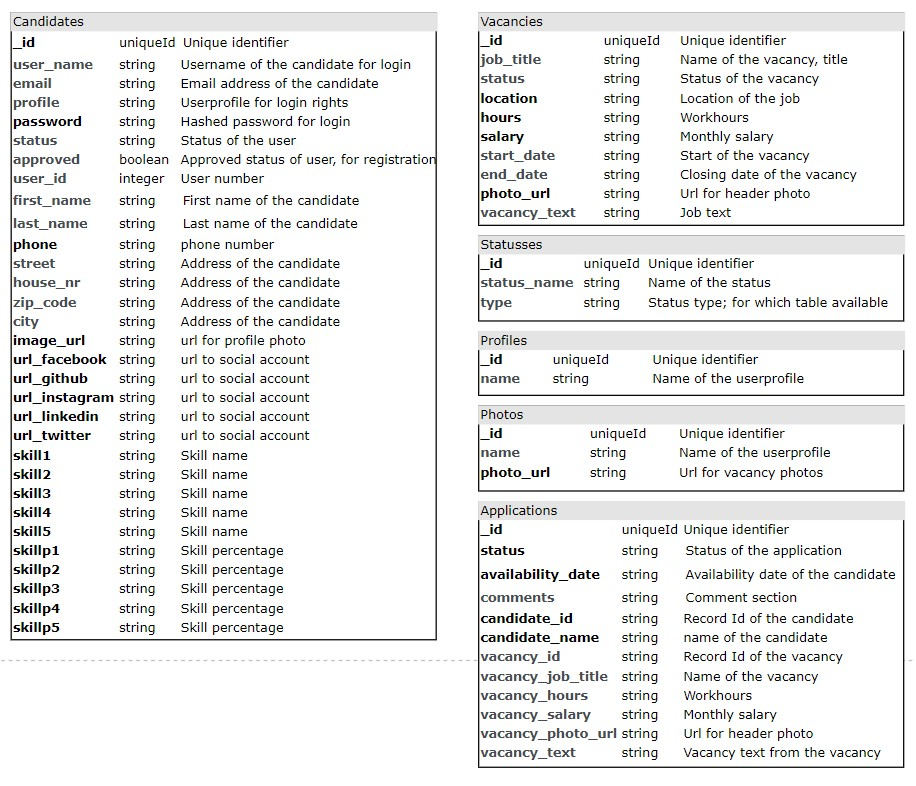

# BOS UP jobboard - Milestone Project 3

## Introduction
Welcome to [BOS UP](https://jobboard-milestone3.herokuapp.com/)! This site is created to let potential candidates know who we are and what we do. And also we want to give the option to see if they want to come and join us! If a candidate registers on our site and our recruiter has had contact with them, the candidate can apply on several cool and interesting vacancies. At all time they can see where they are in the application process, which will get them more engaged with the whole team. I hope you take a look at the site and maybe we will see you at the meeting!


## Contents
1. [UX](#UX)
     - [Project Goals](#project-goals)
     - [User Stories](#user-stories)
     - [Wireframes](#wireframes)
     - [Design](#design)
     - [Database](#database)
        - [Tables](#tables)
        - [Tables design](#tables-design)
2. [Features](#features)
    - [Existing Features](#existing-features)
    - [Features Left to Implement](#features-left-to-implement)
3. [Technologies Used](#technologies-used)
    - [Languages](#languages)
    - [Apps-Api](#apps-api)
    - [Framework](#framework)
    - [Resources](#resources)
4. [Testing](#testing)
    - [Error pages](#error-pages)
    - [Validators](#validators)
    - [Testing User Stories](#testing-user-stories)
    - [Login-Register Validation](#login-register-validation)
    - [Unittesting](#unittesting)
    - [Further testing](#further-testing)
    - [Issues found (all solved)](#issues-found-all-solved)
5. [Deployment](#deployment)
    - [MongoDB](#mongodb)
    - [Env.py](#env-py)
    - [For my assessors](#for-my-assessors)
6. [Credits](#credits)
    - [Content](#content)
    - [Media](#media)
    - [Acknowledgements](#acknowledgements)

## UX

### Project Goals
[BOS UP](https://jobboard-milestone3.herokuapp.com/) is part of my Code Institute Full Stack Software Development course, the Data Centric Development module. The scope for this milestone project is to "Build a MongoDB-backed Flask project for a web application that allows users to store and manipulate data records about a particular domain." So I created a jobboard where visitors can access the vacancies and register, candidates can login and apply and admins can admin. All CRUD operations are implemented in the site, where I made a distinctive choice about what user can do which operation. The target audience is for people around all ages who are looking for a job in our branche (utility sector).

### User Stories
<details>
<summary>General website user (visitor)</summary>

1. As a visitor, I want to be able to see general information about the company so I get a 'feel' about the corporate culture
2. As a visitor, I want to be able to see which vacancies are available at the company
3. As a visitor, I want to be able to register so I can get a log in for the site
4. As a visitor, I want to be able to get in contact so I can get more information about a partically subject

</details>
<details>
<summary>Candidate (logged in) user</summary>

1. As a user, I want to be able to log in my user environment so I can see all information applicable to me
2. As a user, I want to be able to log out my user environment
3. As a user, I want to be able to see which vacancies are available at the company, so I can apply to them
4. As a user, I want to be able to apply to a open vacancy, so I can join the company
5. As a user, I want to be able to see my application history, so I can know which applications are still ongoing
6. As a user, I want to be able to see and change my profile information, so this is up to date
7. As a user, I want to be able to change my password
</details>
<details>
<summary>Administrator</summary>

1. As the admin, I want to be able to see and do all the user stories of a logged in user so I can perform regular actions.
2. As the admin, I want to be able to have an overview of vacancies, applications and user in the environment.
3. As the admin, I want to be able to add, close, edit and delete vacancies so that I can controle the content available for website and candidate users.
4. As the admin, I want to be able to add, close, edit and delete applications for candidates and vacancies that I can controle the content. available for website and candidate users
5. As the admin, I want to be able to add, deactivate, edit and delete users so that I can give candidates login credentials.
6. As the admin, I want to be able to approve new registrations so no one can get access without permission/controle.
7. As the admin, I don't want other profiles to be able to use pages from where important changes to the database can be made

</details>

### WireFrames
During the project I got a lot of feedback and strayed away from the initial wireframes. The login, register and contct pages are replaced by modals instead of the initial pages.
<details>
<summary>Home Page</summary>
<br>

<p>Visitor</p>


<p>User</p>


<p>Admin</p>


</details>

<details>
<summary>Vacancies</summary>
<br>

<p>Visitor</p>


<p>User</p>


<p>Admin</p>


<p>Admin add vacancy</p>


<p>Admin edit vacancy</p>


</details>

<details>
<summary>Applications</summary>
<br>
<p>User</p>


<p>User Add Application</p>


<p>Admin</p>


<p>Admin Add Application</p>


<p>Admin Edit Application</p>


</details>
<details>
<summary>Users</summary>
<br>
<p>User Profile</p>


<p>User Edit User</p>


<p>Admin</p>


<p>Admin Add User</p>


<p>Admin Edit User</p>


</details>

<details>
<summary>Contact</summary>
<br>
<p>All</p>


</details>

<details>
<summary>Register</summary>
<br>
<p>Visitor</p>


</details>

<details>
<summary>Login</summary>
<br>
<p>Visitor</p>


</details>

### Design
<ins>Color Scheme</ins><br/>
The color scheme is chosen because of the corporate identity of BOS UP, which contains a blue pallet of colors.

The two most important colors are lightskyblue and cadetblue. To make the site easy to read, I used these two colors on the most pages. For buttons I used custom bootstrap design, to let them stand out. For instance; I do want to make the delete button red!

-  `#5F9EA0 - CadetBlue`
-  `#87CEFA - LightSkyBlue`

For texts I used three main colors; the standard black, a grey one and a white one. I used the standard and the grey to get a bit of contrast between them. The white one is for sections where the background is darker, for instance a jumbotron.
-  `#000000 - Black`
-  `#777777 - Grey`
-  `#FAFAFA - Offset white`

I used a body background color for contrast so cards and tables stand out more, also this gives a less cheaper and easier on the eye look to the site.
-  `#E2E8F0 - very light grey `

For error messages I used a yellow background to really stand out.

<ins>Typography</ins><br/>
The font I selected to this page is Play from [GoogleFonts](https://fonts.google.com/), because it is professional but not as common used. The font is simple but yet adds some character.


### Database
This website has a [MongoDB](https://www.mongodb.com) databases called jobboard_milestone3, within this database I've used 5 tables (or collections). I used [MongoDB](https://www.mongodb.com) on advise of my mentor and CodeInstitute for this project and for this phase of the development of the website this works fine. However I must add; whenever expanding your business processes further in this portal, I would highly recommend taking a new look to your chosen database. For example if you want to add more HR and employee processes it is my advice to do this with an relationship based database.

#### Tables
The most tables are self explanatory, but I consciously chose to use one table for candidates and users due to the size of the project and the simplicity of the current business processes. I allready created a profiles table, this simplifies editing or creating a new user by the admin and prevents a typo but also this anticipates on the possibility of implementing new user profiles. 

#### Tables design


## Features

### Existing Features
- [x] Vacancies on site
- [x] Registration form
- [x] Login form
- [x] Hashed passwords
- [x] Contact form
- [x] Login for candidates
- [x] Admin environment
- [x] CRUD Vacancies
- [x] CRUD Applications
- [x] Approve new registrated users
- [x] Close Vacancies and/or Applications
- [x] Change password
- [x] Profile section
- [x] Quick action menu
- [x] 403, 404, 500 Error handling (and pages)
- [x] CRUD Users/candidates
- [x] Manual search option
- [x] Setup page for admin

### Features Left to Implement
- [ ] Trashbin
- [ ] Cloning of records
- [ ] Forgot password
- [ ] Userprofile: office employee

## Technologies Used
I have used the following technologys for this project:

### Languages
* [HTML5](https://en.wikipedia.org/wiki/HTML5), Semantic markup language as the shell of the site
* [CSS3](https://en.wikipedia.org/wiki/CSS), Cascading Style Sheets as the design of the site
* [JavaScript](https://en.wikipedia.org/wiki/JavaScript), for the contact form and preventing prefilled forms
* [jQuery](https://jquery.com/), for some initializing and support of [Materialize](https://materializecss.com/)
* [Python](https://www.python.org), for the backend
    - Flask, for custom functions
    - flask_pymongo for connection to my [MongoDB](https://www.mongodb.com)
    - bson.objectid
    - werkzeug.security, for hashed passwords
    - functools, for my own view decorators
* [BSON](https://en.wikipedia.org/wiki/BSON), to store my data

### Apps-Api
* [MongoDB](https://www.mongodb.com), for my database
* [Heroku](https://heroku.com), to deploy my app
* [Gitpod](https://gitpod.io), for development
* [Github](https://github.com), for version control
* [EmailJS](https://www.emailjs.com/), to let the user be able to contact me
* [Balsamiq](https://balsamiq.com/wireframes/desktop/), for creating the wireframes
* [TinyPNG](https://tinypng.com/), for reducing the filesizes on my images

### Framework
* [Materialize](https://materializecss.com/), for icons
* [Bootstrap](https://getbootstrap.com/), for CSS and HTML framework for ex. modals
* [Bootstrap Icons](https://icons.getbootstrap.com/), for icons
* [Google Fonts](https://fonts.google.com/), to choose and combine my fonts

### Resources
* [Iconmonstr](https://iconmonstr.com/), for social svg images
* [Encycolorpedia](https://encycolorpedia.nl/), for coloring the svg images
* [Unsplash](https://unsplash.com/), for images

## Testing

### Error pages
I tested the 404 error with [seositecheckup](https://seositecheckup.com/seo-audit/custom-404-error-page-test/jobboard-milestone3.herokuapp.com). Further more I tested these page by temporary using abort(nr) in a view to see if it would redirect correctly.

### Validators
To make sure there where nog syntax errors, I've used the following validators on my pages:
* [HTML validator](https://validator.w3.org/#validate_by_input)
* [CSS validator](https://jigsaw.w3.org/css-validator/)
* [PEP8](http://pep8online.com/checkresult)

### Testing User Stories
- Visitor
    1. As a visitor, I want to be able to see general information about the company so I get a 'feel' about the corporate culture:
        - By using the navbar menu I can visit the Home page to see the main page.
    2. As a visitor, I want to be able to see which vacancies are available at the company:
        - By using the navigation menu I can visit the Vacancies page to see the open vacancies.
        - By using the search field in the navbar I can find vacancies with a quick search function on name, text or location.
    3. As a visitor, I want to be able to register so I can get a log in for the site:
        - By using the navigation menu I can open the Register modal to register me as a candidate/user.
        - I will get error messages on the Home page if my registration isn't processed.
        - I will get a succes message on the Home page if my egistration is processed.
    4. As a visitor, I want to be able to get in contact so I can get more information about a partically subject:
        - I can use the menu to go to open the Contact modal.
        - On the Contact modal I can fill in my name e-mailadress and message.
        - The contact form will let me know all fields are manditory.
        - I can send in the form by clicking the Submit button.


- User (candidate logged in)
    1. As the user, I want to be able to see and do all the user stories of a visitor:
        - See user stories visitor
    2. As a user, I want to be able to log in my user environment so I can see all information applicable to me:
        - By clicking the login button in the menu I will open the login modal.
        - As an user I can login by using my own username and personal password.
        - The form will let me know both fields are mandetory.
        - I will get error messages on the Home page if my login isn't processed.
        - I will be redirected to the Home page and my navbar will show My Application and my name to confirm I'm logged in.
    3. As a user, I want to be able to log out my user environment:
        - When I'm logged in I can logout by using the logout button in the navigation menu.
        - I will be redirected to the Home page and My Application and my name will dissappear form the navbar.
    4. As a user, I want to be able to apply to a open vacancy, so I can join the company:
        - By navigating to the Vacancies page I can use the 'Apply to this vacancy!' button on a vacancy to apply to that vacancy.
        - On the Application page I can fill in my availbility date and add some personal comments.
        - I also see some brief information of the vacancy.
        - I can Save to apply and get redirected to My Application.
        - I can Cancel and get redirected back to Open Vacancies.
    5. As a user, I want to be able to see my application history, so I can know which applications are still ongoing:
        - By using the navigation menu I can visit the My Applications page to see all of my applications.
    6. As a user, I want to be able to see and change my profile information, so this is up to date:
        - By using the navigation menu I can visit my Profile page by clicking on my name.
        - Here I can see all of my profile information:
            - User information
            - Photo
            - Candidate information
            - Address information
            - Social sites
            - Skills
        - I can edit my profile by clicking on the edit button.
        - On the Edit Profile page I can change my info and either:
            - Save, this will save changes and go back to my profile.
            - Cancel, this will ignore my changes and go back to my profile.
    7. As a user, I want to be able to change my password:
        - By using the navigation menu I can visit my Profile page by clicking on my name.
        - I can change my password by clicking on the Change password button to open a modal.
        - On the Change Password modal I can fill in my old and new password as well as a confirmation of the new password.
        - The contact form will let me know all fields are manditory.
        - I can save my change in the form by clicking the Save button.


- Admin
    1. As the admin, I want to be able to see and do all the user stories of a logged in user so I can perform regular actions:
        - See user stories user
    2. As the admin, I want to be able to have an overview of vacancies, applications and users in the environment:
        - By using the navigation menu I can visit the Vacancies page to see all the vacancies.
        - By using the navigation menu I can visit the Applications page to see all the applications.
        - By using the navigation menu I can visit the Users page to see all the users.
    3. As the admin, I want to be able to add, close, edit and delete vacancies so that I can controle the content available for website and candidate users:
        - By navigating to the Vacancies page I can use the 'Add Vacancy' button on top of the page.
            - On the Add Vacancy page I can fill in all fields for a new vacancy.
            - I also select a picture which will be the header of the vacancy card.
            - On the Add Vacancy page I can either:
                - Save, this will add the new vacancy and go back to the Vacancies page.
                - Cancel, this will ignore my input and go back to the Vacancies page.
        - By navigating to the Vacancies page I can use the 'Edit' button on a specific vacancy.
            - On the Edit Vacancy page I can change the vacancy info and either:
                - Save, this will save changes and go back to the Vacancies page.
                - Update, this will save changes and stay on this page.
                - Cancel, this will ignore my changes and go back to the Vacancies page.
        - By navigating to the Vacancies page I can use the 'Close' button on a specific vacancy.
            - I will see the vacancy moved to the Closed Vacancies section at the bottom of the page.
        - By navigating to the Vacancies page I can use the 'Delete' button on a specific vacancy.
            - I will see the vacancy removed from the page.
    4. As the admin, I want to be able to add, close, edit and delete applications for candidates and vacancies so that they are available for the candidate user:
        - I can create an application the same as a user can from a vacancy, only the button the vacancy has the name 'Application' (see user storie user)
        - By navigating to the Application page I can use the 'Add Application' button on top of the page.
            - On the Add Application page I can fill in all fields for a new application.
            - On the Add Application page I can either:
                - Save, this will add the new application and go back to the Applications page.
                - Cancel, this will ignore my input and go back to the Applications page.
        - By navigating to the Applications page I can use the 'Edit' button on a specific application.
            - On the Edit Application page I can change the application info and either:
                - Save, this will save changes and go back to the Applications page.
                - Cancel, this will ignore my changes and go back to the Applications page.
        - By navigating to the Applications page I can use the 'Close' button on a specific application.
            - I will see the application moved to the Closed Applications section at the bottom of the page.
        - By navigating to the Applications page I can use the 'Delete' button on a specific application.
            - I will see the application removed from the page.
    5. As the admin, I want to be able to add, deactivate, edit and delete users so that I can give candidates login credentials:
        - By navigating to the Users page I can use the 'Add User' button on the page.
            - On the Add User page I can fill in all fields for a new user.
            - On the Add User page I can either:
                - Save, this will add the new user and go back to the Users page.
                - Cancel, this will ignore my input and go back to the Users page.
        - By navigating to the Users page I can use the 'Edit' button on a specific user if the user is active.
            - On the Edit User page I can change the user info and either:
                - Save, this will save changes and go back to the Users page.
                - Cancel, this will ignore my changes and go back to the Users page.
        - By navigating to the Users page I can use the 'Deactivate' button on a specific user if the user is active.
            - I will see the user moved to the Inactive Users section at the bottom of the page.
        - By navigating to the Users page I can use the 'Delete' button on a specific user.
            - I will see the user removed from the page.
    6. As the admin, I want to be able to approve new registrations so no one can get access without permission/controle:
        - By navigating to the Users page I can use the 'Approve' button on a specific user in the Users asking for approval section.
            - I will see the user moved to the Active Users section.

    7. As the admin, I don't want other profiles to be able to use pages from where important changes to the database can be made:
        - As a user or visitor I can try to open the 

### Login-Register Validation
There are some login checks with error message shown, you will get redirected to the index page and the message is shown in the top off the page. The error with message:
- Wrong password; "Your password is incorrect"
- User isn't approved yet by admin; "Your registration is not processed yet"
- User isn't approved yet by admin; "This user is inactive, please contact the administrator"
- Username is incorrect; "The username provided is not known"

Registration; the error with message:
- Username exists; "{username} already exists! Please choose a different username."
- User isn't created; "There was a problem saving your registration. If this happens again, please use the contactform to contact the administrator of the website."
- Two different passwords; "Passwords are not identical. Please try again."
- Username is shorter then 8 characters; "Username should be at least 8 characters"

If the registration is a succes you will get the message:"Your registration is saved, we will get in touch with you."

### Unittesting
For the Unittests I focussed mostly on authorisation, page loads and the error pages. Besides this I also tested the login, logout and register functionality. Because of time I chose to do test the button, actions, queries and database modifiers in the user storie testing. 

### Further testing
* Tested this website on laptop and mobile.
* Tested this website on Google Chrome, Firefox and Safari browsers.
* I've asked colleagues and friends to give feedback.
* I've asked for peer reviews on Slack.
* During testing I used "inspect" function on different OS, devices and browsers.


### Issues found (all solved)
* When implementing the sidebar nav form materialize I came accross the issue that the sidebar was greyed out. I found the solution [here](https://github.com/Dogfalo/materialize/issues/3844)
* Visitors and users can see urls from which they should have no access rights. I wouldn't want to solve this with several if-else statements in every route/view. So I asked arround and with a little help I created my own decorator for this. 


## Deployment
This project was created using Github, from there I used Gitpod to write my code.
Then I used commits to git followed by pushes to my GitHub repository.
I've deployed this project to Heroku and used automated pushes to make sure my pushes to GitHub were also made to Heroku.
For deployment on Heroku I've used the following steps:
* Using the terminal command pip freeze > requirements.txt I have created a requirements.txt file.
* Using the terminal command echo web: python app.py > Procfile I have created a procfile.
* I've used git add, git commit and git push to push the requirements and procfile to GitHub.
* I've created a new app on the Heroku website by using the "new" button on my dashboard.
* I gave the app a name of jobboard-milestone3 and set the region to Europe.
* From the Heroku dashboard I've clicked "Deploy" > "Deployment method" and selected GitHub.
* Confirm the linking of the Heroku app to the correct GitHub repository.
* In the Heroku dashboard I've clicked "Settings" > "Reveal Config Vars".
* I've added the config vars for my IP, PORT, MONGO_URI and SECRET_KEY.
* In the "Manual Deployment" section of this page I've made sure the master branch is selected and I've clicked "Deploy Branch".
* The site was now successfully deployed.

### MongoDB
Create a MongoDB database with the tables(collections):
- applications
- candidates
- photos
- profiles
- status
- vacancies

Then you can use below code to create the first admin user. From there on, you can use the site to add, modify or delete users.

```
import os
from flask import Flask
from flask_pymongo import PyMongo
from werkzeug.security import generate_password_hash

app = Flask(__name__)
MONGO_URI = "mongodb+srv://root:<PASSWORD_MONGODB>@myfirstcluster.vwkuk.mongodb.net/<NAME_MONGODB>?retryWrites=true&w=majority"
app.config["MONGO_DBNAME"] = '<NAME_MONGODB>'
app.config["MONGO_URI"] = MONGO_URI
mongo = PyMongo(app)

username = 'TESTROBBERT'
user_password = 'TESTROBBERT'
email = 'bos@bos.bos'
hash_pass = generate_password_hash(user_password)

mongo.db.candidates.insert_one(
    {
        'user_name': username,
        'email': email,
        'password': hash_pass,
        'approved': True,
        'status': 'active',
        'profile': 'admin',
        'user_id': 1
    }
)
```

### Env.py
In Gitpod I used a env.py file for my settings of the site, connection to [MongoDB](https://www.mongodb.com). I also used this for the Flask Unittests. I used the code below (with <> substituted for my string).

```
import os

os.environ["MONGO_URI"] = "mongodb+srv://root:<PASSWORD_MONGODB>@myfirstcluster.vwkuk.mongodb.net/<NAME_MONGODB>?retryWrites=true&w=majority"
os.environ["SECRET_KEY"] = "justtasecretkeyforme"

# For testing
os.environ["USERNAME_ADMIN"] = '<USERNAME_ADMIN>'
os.environ["USERNAME_USER"] = '<USERNAME_USER>'
os.environ["SPW_ONE"] = '<PASSWORD_ADMIN>'
os.environ["SPW_TWO"] = '<PASSWORD_USER>'
```

### For my assessors
03-10-2020 :<br>
I had an issue with my credentials appearing in cached Python files/folders. So I had to remove the <span>__ Pycache __</span> folder and all history. I did this with:
```
git filter-branch --tree-filter 'rm -f __Pycache__/*' -- --all
git push force
```

Also I want to point out that more atomic commits are not possible for me with the use of Gitpod. During the course I experienced some 20+ issues thus far regarding 503 errors. 

## Credits
### Content
The idea, content and development for this project was written or designed by myself.

### Media
The logo was designed en made by myself. 
I used images from [Unsplash](https://unsplash.com/) throughout my site.

Thanks to:
[Albert Dera](https://unsplash.com/@albertdera), for a profile image
[Clem Onojeghuo](https://unsplash.com/@clemono), for a vacancy image
[Florian Olivio](https://unsplash.com/@florianolv), for a vacancy image
[Glenn Carstens-Peters](https://unsplash.com/@glenncarstenspeters), for a vacancy image
[Jimmy Fermin](https://unsplash.com/@jimmyferminphotography), for a profile image
[Marvin Meyer](https://unsplash.com/@marvelous), for the main index background image
[Shahadat Rahman](https://unsplash.com/@hishahadat), for a vacancy image

### Acknowledgements
Thanks to [Tim (Justim)](https://github.com/justim) for some deeper explanation about Python views and decorators. Helped me with the login view decorator.

Special thanks to [Paul Friel](https://github.com/Spagettileg) who repeatedly and thoroughly gave me feedback on my site during the project.

And a thanks to my mentor [Precious Ijege](https://www.linkedin.com/in/precious-ijege-908a00168/) who gave me honest and good feedback on my site/code and helped me te complete this project.

[w3schools](https://www.w3schools.com/) and [StackOverflow](https://stackoverflow.com/) for research.